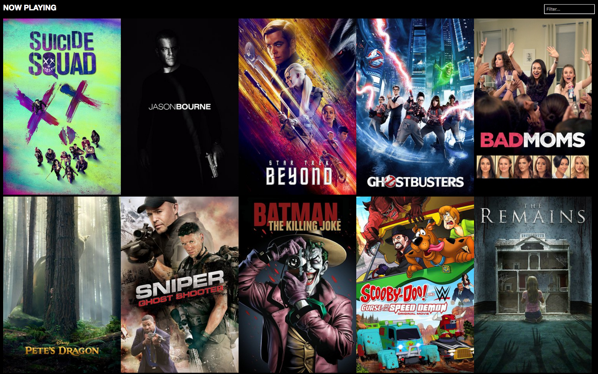

# angular2-now-playing - Example Angular 2 Application

This repository contains an example Angular 2 application that displays movies currently at the theater. It was built solely as an example of using Angular 2 and is not intended to be used beyond the learning experience. 

The project utilizes the [TMDb API](https://www.themoviedb.org/).

Note: the image shown above is not owned by Keyhole, and all copyrights belong to their respective owners. The image used here is only for education and is not intended to generate income.

While this application is an excellent standalone learning resource, it was also used as a live coding example in the Keyhole Software Breakfast Boost Series "Angular 2 In Action." See below for more information.

### Comparing to React
A similar now-playing app has been developed using React. See what makes this app different by checking it out [here](https://github.com/in-the-keyhole/khs-react-course). 

### Comparing to Angular 1
A similar now-playing app has been developed using Angular 1. See what makes this app different by checking it out [here](https://github.com/in-the-keyhole/angular-now-playing). 

## Getting Started

Prerequisites: You must have Node/npm installed.

1. npm install
2. npm start

This will run the TypeScript compiler in watch mode, and lite-server with Browsersync enabled.  It should automatically launch your default web browser on http://localhost:4200.

### More Information On "Angular 2 In Action!"
In this educational talk, Keyhole Principal Consultants present a live demonstration of Angular 2 in action.

AngularJS is one of the most popular JavaScript frameworks available for creating web applications. The switch from Angular 1 and adoption of Angular 2 has been a source of anxiety for members of the enterprise. That enterprise concern is what we seek to alleviate in this talk. 

Throughout the talk, Principal Consultants build an example Angular 2 application applicable to enterprise use. They will point out unique features and approaches the Angular 2 framework introduces, with an eye for potential pitfalls. The presentation will show how it contrasts from Angular 1 and other comparable JavaScript frameworks, in addition to a contrast from existing development patterns and techniques.

All public Keyhole Software educational events can be found on the [Keyhole Eventbrite page](http://www.eventbrite.com/o/keyhole-software-2942446951).

This content is from [Keyhole Software](https://keyholesoftware.com). We love knowledge transfer!
